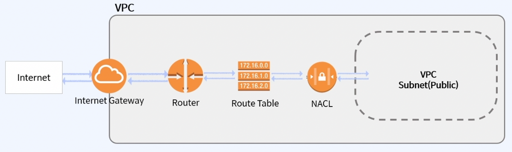
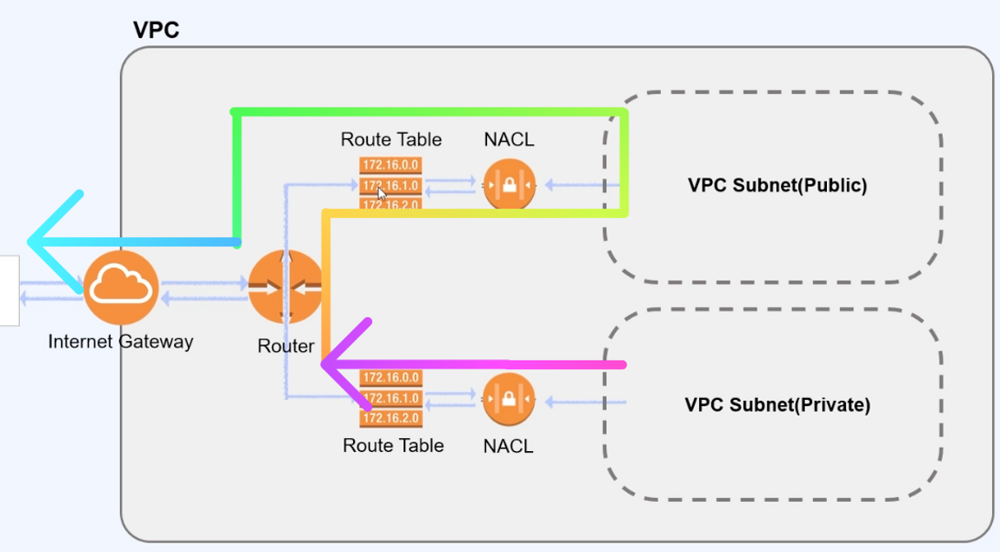
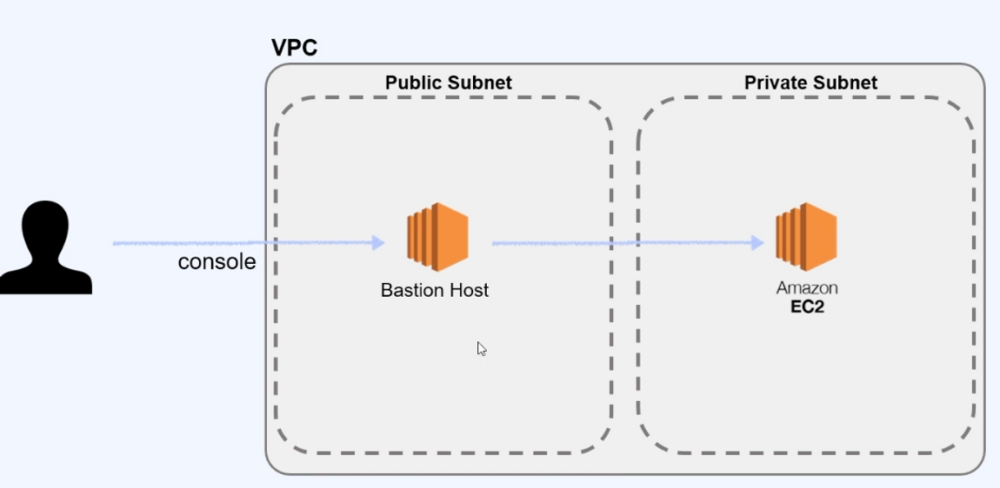
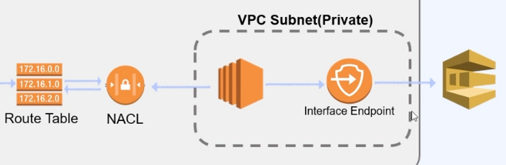
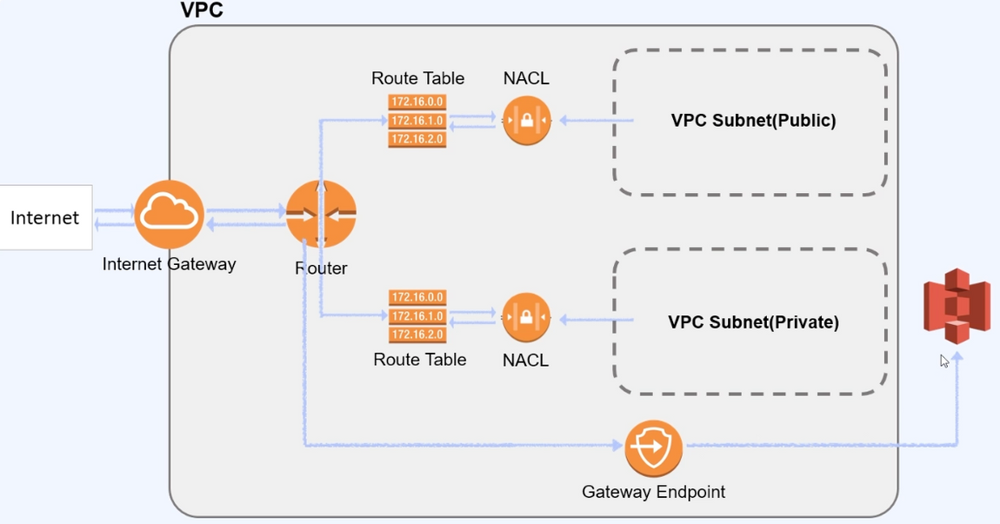

<!-- 스포일러 추가 시    -->
안녕하세요

AWS 인프라 구축하면서 배운 내용들에 대해 공유드리려고 합니다.

 

#### AWS Network

##### VPC (Virtual Private Cloud)

---

- 사용자가 정의한 일종의 **가상 네트워크입니다.**
- 이 가상 네트워크는 AWS의 확장 가능한 인프라를 사용한다는 이점과 함께 자체 데이터 센터에서 운영하는 **기존 네트워크와 매우 유사**합니다.

##### 특징

---

1. EC2의 네트워크 계층입니다.
2. EC2, RDS, S3 등 다양한 AWS 서비스에 활용 가능합니다.
3. 서브넷 구성이 가능합니다.
4. 보안 설정(IP block, inbound, outbound)이 가능합니다.
5. VPC Peering(VPC 간의 연결)이 가능합니다.
6. IP 대역을 지정할 수 있습니다.
7. VPC는 하나의 Region에만 속할 수 있습니다.
    1. 다른 Region으로 확장 불가능
    2. **Internet Gateway**는 VPC안에 있는 객체와 인터넷의 소통을 도와줍니다.

    

 

##### 구성 요소
##### 1. Availability Zone
---
- Region & Availability Zone
- 물리적으로 분리되어 있는 인프라가 모여 있는 데이터 센터를 말합니다.
- 각 AZ는 일정 거리 이상 떨어져 있습니다.
- 하나의 리전은 2개 이상의 AZ로 구성됩니다.

    

 

##### 2. Subnet
---
- 하나의 네트워크를 작은 단위로 분할한 네트워크
- VPC의 하위 단위입니다.
    - sub + network
- 하나의 AZ에서만 생성 가능하고, 여러 개의 Subnet을 생성할 수 있습니다.

    

        
    

    

        
    

###### Public Subnet

- IGW로 라우팅되어 **인터넷에 접근이 가능**합니다.

###### Private Subnet

- **Internet Gateway**로 라우팅되지 않아 **인터넷에 접근이 불가능**합니다.
- 외부 네트워크에 접근 불가, 내부에서만 소통 가능합니다.

 

##### 3. CIDR(Classless Inter-Domain Routing)
---
- 클래스 없는 도메인간 라우팅 기법으로, 기존의 IP 주소 할당 방식이었던 클래스를 대체하여 IP주소의 네트워크 영역, 호스트 영역을 유연하게 나누어줍니다.
- 하나의 VPC 내에 있는 여러 IP 주소를 각각의 Subnet으로 분리/분배할 수 있습니다.

 

##### 4. Internet gateway (IGW)
---
- VPC는 기본적으로 격리되어 있는 네트워크 환경입니다.
    - VPC 내부의 리소스들은 인터넷에 연결할 수 없습니다.
- **VPC가 Internet과 연결**될 수 있도록 도와줍니다.
    - VPC마다 하나의 IGW를 가져야합니다.
- Route table에 IGW로 향하는 규칙을 추가하여 인터넷과 연결될 수 있습니다.
- Private Subnet은 IGW로 연결되어 있지 않습니다.

    

 

##### 5. Route table
---
- VPC의 네트워크 트래픽을 전달할 위치를 결정하는데 사용합니다.
    - 로컬 또는 외부(IGW)로 안내합니다.
- VPC 생성 시 자동으로 만들어줍니다.
    
    
    | 대상 (Destination) | 대상 (Target) |
    | --- | --- |
    | 10.0.0.0/16 | local |
    | 0.0.0.0/0 | igw-id |
    | ::/0 | igw-id |
    - 10.0.0.0/16 (10.0.0.0 ~ 10.0.255.255) → Local (기본설정)
    - 나머지는 IGW(인터넷) 즉, VPC 외부가 대상이 됩니다.
    - Private subnet은 위 표에서 igw-id 대신, nat-id를 설정할 수 있습니다.
    
 

##### 6. NACL (Network Access Control List) / SG (Security Group)
---
- 인바운드와 아웃바운드 트래픽에 대해 보안 정책을 설정할 수 있는 방화벽과 같은 역할을 합니다.

##### 특징
- 하나의 NACL은 다수의 서브넷에서 재사용할 수 있습니다.
- `NACL`은 `서브넷 앞`에서 트래픽을 제어하는 역할을 합니다.
- `SG`는 `인스턴스 앞`에서 트래픽을 제어하는 역할을 합니다.
- Access Block은 NACL에서만 가능합니다.
    - 특정 IP 대역을 Inbound로 들어오는 것을 막아버리고 싶을 때, Access Block으로 막을 수 있습니다.
- Route Table에서 NACL을 통해서 VPC Subnet으로 가게 됩니다. (SG는 VPC Subnet의 설정값)
- Private Subnet의 경우 외부로 나가지 않게 Route Table이 막습니다.

| 구분 | NACL (네트워크 ACL) | SG (보안 그룹) |
| --- | --- | --- |
| 서비스 범위 | 서브넷 레벨 | 인스턴스 레벨 |
| 적용 정책 | 허용 및 거부 규칙 적용 | 허용 규칙만 적용 |
| 적용 방법 | 연결된 서브넷 모든 인스턴스에 자동 적용 | 인스턴스에 보안 그룹 추가 필요 |

 

 

##### 7. NAT (Network Address Translation) instance/gateway
---
- 보통 서비스를 구성할 때 `Private Subnet을 사용한다고 하더라도 외부 시스템으로의 접속이 필요한 경우`가 있습니다. 이러한 경우 Private에서 Public으로 binding하여 연결할 수 있도록 도와줍니다.
- **NAT Instance**는 Public Subnet을 가진 EC2 Instance입니다.
- **NAT Gateway**는 네트워크 주소 변환 서비스입니다.
- Public Subnet은 Route Table을 거쳐 Internet Gateway로 전송할 수 있습니다.
- Private Subnet은 Internet Gateway로 전송할 수 없습니다. (Route Table에서 막기 때문)
    - 주로 Private Subnet은 데이터베이스와 같이 보안적으로 중요한 것들을 Private으로 합니다.
    - 이러한 서비스를 설치하거나 업데이트해야 할 때 외부 네트워크가 필요합니다.
        - Private에서 Public으로 트래픽을 전송 → Public에서 Internet으로 전송을 대신합니다.
        - 응답은 이와 반대로 생각하시면 됩니다.

    

 

##### 8. Bastion host
---
- Public Subnet을 가진 EC2 인스턴스입니다.
- VPC 밖에 있는 관리자가 Private Subnet 내에 있는 Instance에 어떤 작업을 해야할 때 사용합니다.
- 외부에서 Private Subnet으로 접근하기 위한 수단입니다.

    

 

##### 9. VPC endpoint
---
- VPC 엔드포인트를 통해 인터넷 게이트웨이, NAT 디바이스, VPN 연결을 필요로 하지 않고 AWS 서비스 및 VPC 엔드포인트 `서비스에 비공개로 연결`할 수 있습니다. VPC의 인스턴스는 서비스의 리소스와 통신하는데 퍼블릭 IP 주소를 필요로 하지 않습니다.
- 어떤 서비스에 퍼블릭 IP 주소 없이 비공개로 연결할 때 사용합니다.
- AWS의 여러 서비스들과 VPC를 연결시켜주는 중간 매개체 역할을 합니다.
    - AWS에서 VPC 바깥으로 트래픽이 나가지 않고, 여러 서비스를 사용할 수 있게 만들어 줍니다.
    - Private Subnet 같은 경우는 격리된 공간인데 불구하고, AWS의 다양한 서비스들(S3, dynamoDB, athena 등)과 연결할 수 있도록 지원

 

##### 10. Interface Endpoint
---
- Private IP를 만들어 외부 서비스로 연결해줍니다. (SQS, SNS, Kinesis, Sagemaker 등 지원)

    

 

##### 11. Gateway Endpoint
---
- 라우팅 테이블에서 경로의 대상으로 지정하여 사용합니다. (S3, dynamoDB 지원)
- 어떤 경로로 보낼지 지정할 수 있습니다.

    

 

##### 참고
---

- 한번에 끝내는 AWS 인프라 구축과 DevOps 운영 초격차 패키지
- [AWS Docs VPC](https://docs.aws.amazon.com/ko_kr/ko_kr/vpc/latest/userguide/what-is-amazon-vpc.html)
- [https://icarus8050.tistory.com/55](https://icarus8050.tistory.com/55)
- [https://bcho.tistory.com/779](https://bcho.tistory.com/779)